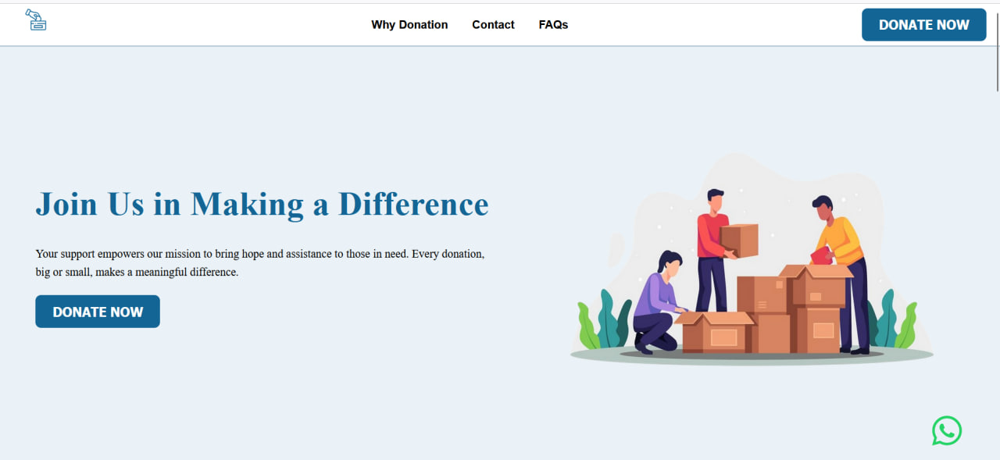
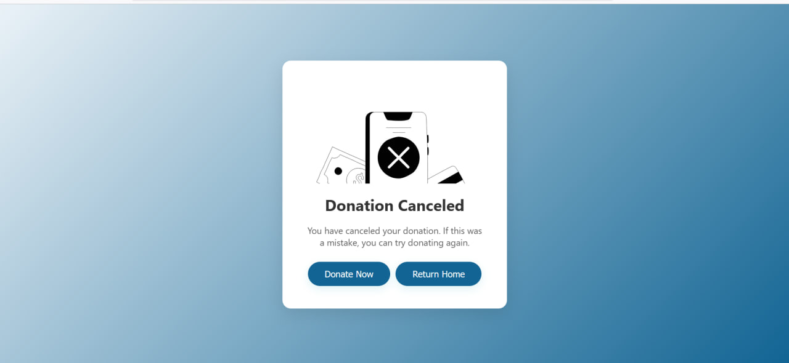
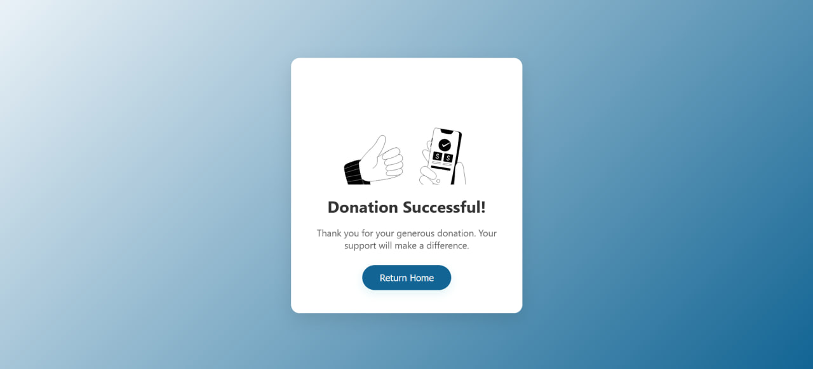
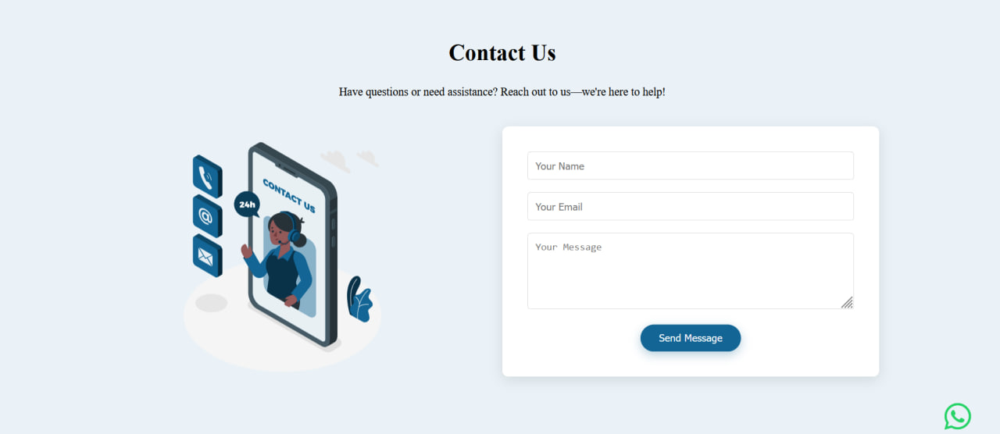
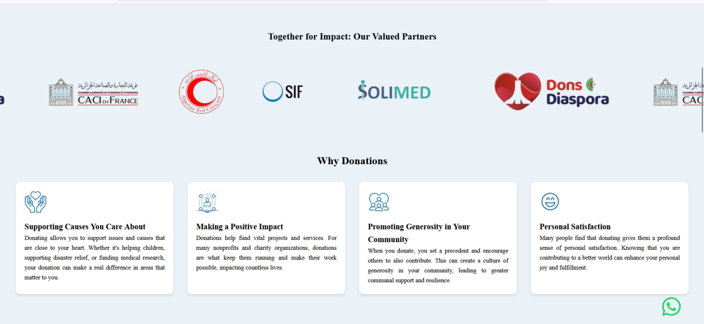
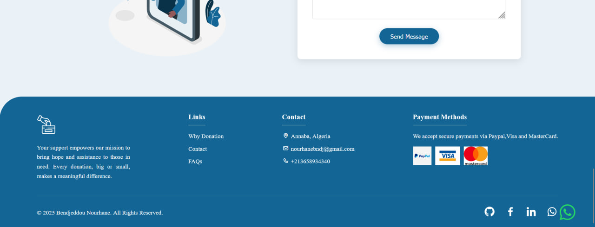

# Donation Platform 🌟

Welcome to our donation platform, where every dollar makes a difference! This project provides a straightforward and secure way to manage and make donations online. Your support enables us to drive positive changes and contribute to various causes.

## 🚀 Overview

This donation platform allows users to quickly and securely donate using PayPal. It is designed to ensure that even the smallest donations are processed smoothly, helping donors contribute to their chosen causes without hassle.

|  |  |  |
|--------------------------------|----------------------------------------|------------------------------------|
|  |  |  |
|---------------------------------------|--------------------------------------|--------------------------------------|
|  |
|--------------------------------------|

## 🛠️ Features

- **🔒 Secure PayPal Integration**: Allows donations to be processed securely via PayPal.
- **👤 User-Friendly Interface**: Easy navigation and a minimalistic design to ensure a pleasant user experience.
- **📊 Real-Time Reporting**: Admins can track donations and generate reports in real-time.
- **📱 Responsive Design**: Fully responsive, ensuring a seamless experience on all devices.

## 🏗️ How It Works
1. **Secure Payment**: Users proceed to PayPal to complete their donation securely.
2. **Confirmation**: After a successful payment, users receive a confirmation of their donation.

## 📦 Setup

To set up the project locally, follow these steps:

```bash
git clone https://github.com/yourusername/donation-platform.git
cd donation-platform
npm install
npm start
```

## 🛠️ Built With

- **HTML5** - For structuring the web content.
- **CSS3** - For styling the interface.
- **JavaScript** - For interactive elements.
- **Laravel** - As the backend framework to handle server-side logic.
- **PayPal API** - For processing payments securely.


## 💳 Supported Payment Methods

- **PayPal**: Secured payments handled through PayPal.


## 🌍 Social Impact

Your donations are impactful. They support a variety of causes and help improve lives. Thank you for your generosity and trust in our mission.

## 📧 Contact

For any inquiries or further assistance, please contact me at nourhanebndj@gmail.com.

